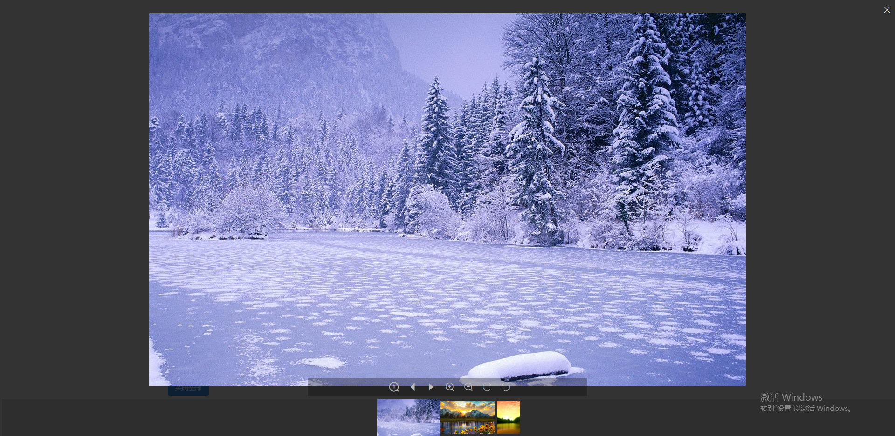
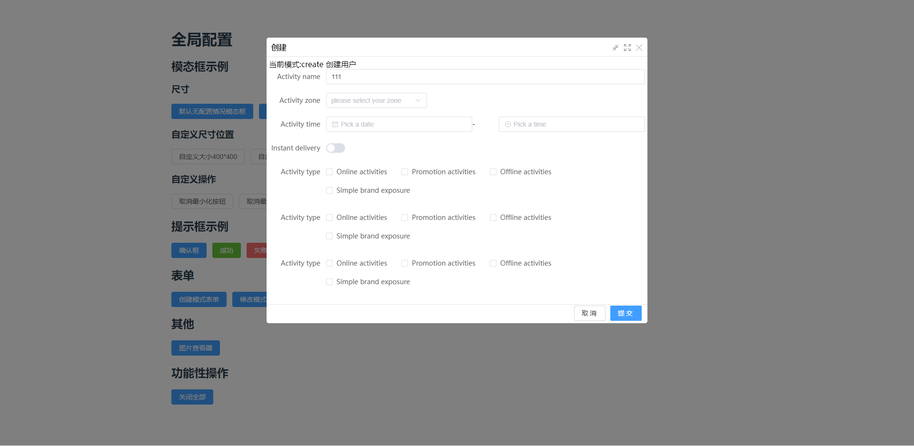
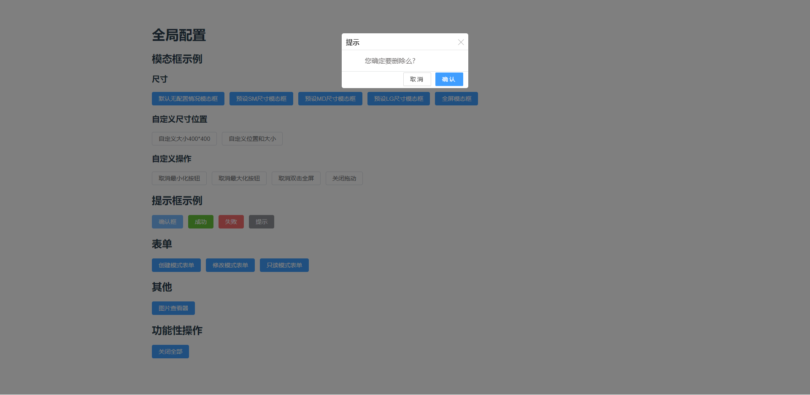

## 插件简介

基于VUE开发的模态框插件，支持常见的表单快速提交和图片预览等功能

## 项目特点

1. 为了快速开发后台管理系统
2. 后期适配移动端和指令式弹框

### 安装
```shell
npm install slash-layer
yarn add slash-layer
```


## 源码

[github](https://github.com/lanmushan/slash-layer)
[gitee](https://gitee.com/lanmushan/slash-layer)

## 开发指南
详细API文档请查看
[API文档](./docs/doc.md)
[示例](./docs/doc.md)


## 依赖

```json
{
  "core-js": "^3.6.5",
  "vue": "^3.0.0",
  "axios": "^0.26.0",
  "less-loader": "^7.3.0",
  "@typescript-eslint/eslint-plugin": "^5.10.1",
  "@typescript-eslint/parser": "^5.10.1",
  "@vue/cli-plugin-babel": "^4.5.15",
  "@vue/cli-plugin-typescript": "^4.5.15",
  "@vue/cli-service": "~4.5.0",
  "@vue/compiler-sfc": "^3.2.29",
  "@vue/eslint-config-typescript": "^10.0.0",
  "babel-eslint": "^10.1.0",
  "docsify-cli": "^4.4.3",
  "eslint": "^8.7.0",
  "eslint-plugin-vue": "^8.4.0",
  "less": "^4.1.2",
  "typescript": "~4.5.5"
}
```
## 部分功能预览效果




