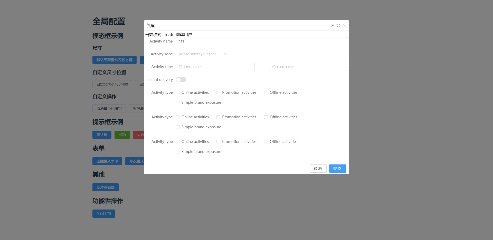
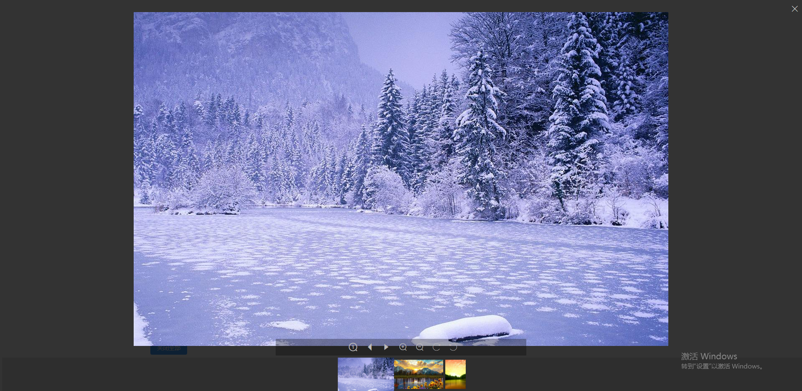
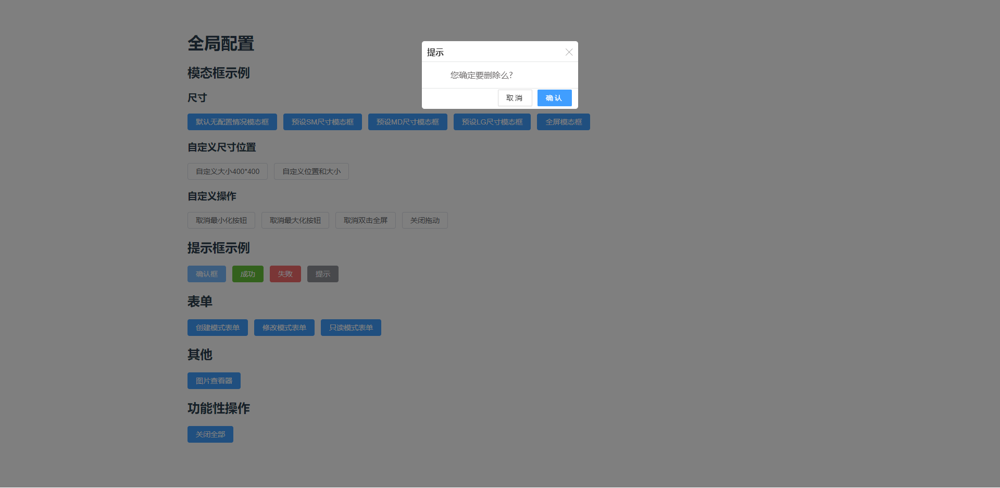

# 快速开始

## 安装

```shell
yarn add slash-layer

npm install slash-layer
```

## 全局配置

```typescript
import {LayerGlobalConfigure} from "../packages/components/Layer/ts/LayerConfigureDefinition";

export const config = {
    title: "自定义全局标题",
    max: false, //最大化按钮
    min: false,//最小化按钮
    header: true, //显示弹出框头部
    loadingTime: 500,//加载效果时长/毫秒
    dbFull: true, //双击面板顶部最大化最小化
    //表单自动提交后对响应结果进行破判断
    successDecide(msg: any) {
        console.log(msg);
        if (msg.code == 200) {
            return {
                msg: msg.msg, result: true, data: msg.data
            }
        } else {
            return {
                msg: msg.msg, result: false, data: msg.data
            }
        }
    }
} as LayerGlobalConfigure
export default config
```

## 使用

```typescript
import {createApp} from 'vue'
import App from './Doc.vue'
import SlashLayer from 'slash-layer';
import {config} from './LayerConfig';

let app = createApp(App);
app.use(SlashLayer, config)
app.mount('#app')

```

# 模态框示例


## 默认无配置情况模态框

```typescript
Layer.modal({
    title: `无配置情况`,
    content: {
        component: HelloWorld,
        parent: this,
        props: {
            msg: "参数传递"
        }
    }
});
```

## 预设SM尺寸模态框

```typescript
Layer.modal({
    title: `sm尺寸`,
    content: {
        position: "sm",
        component: HelloWorld,
        parent: this,
        props: {
            msg: "参数传递"
        }
    }
});
```

## 预设MD尺寸模态框

```typescript
Layer.modal({
    title: `md中等模态框`,
    position: "md",
    content: {
        component: HelloWorld,
        parent: this,
        props: {
            msg: "参数传递"
        }
    }
});
```

## 预设MD尺寸模态框

```typescript
Layer.modal({
    title: `lg大模态框`,
    position: "lg",
    content: {
        component: HelloWorld,
        parent: this,
        props: {
            msg: "参数传递"
        }
    }
});
```

## 全屏模态框

```typescript
Layer.modal({
    title: `无配置情况`,
    position: "full",
    content: {
        component: HelloWorld,
        parent: this,
        props: {
            msg: "参数传递"
        }
    }
});
```

## 自定义尺寸位置

```typescript
  Layer.modal({
    position: {
        top: 200,
        left: 100,
        width: 400,
        height: 400
    }
})
```

# 表单弹框



## 新增表单

### 调用方组件

调用时返回一个Promise,提交成功后且返回接口数据

```typescript
  Layer.createForm({
    title: "新增系统",
    content: {
        component: SystemManagementUpdate,
        props: {
            id: "xxx"
        }
    }

} as FormConfigure).then(res => {
    //执行后续操作
})
```

### 内容组件

在点击提交按钮时会调用子组件的该方法，该方法可以返回一个Promise，也可以返回数据

```typescript
   const doSubmit = async () => {
    console.log("保存")
    if (!formInstance)
        return;
    let result = await checkFormData();
    if (!result) {
        return;
    }
    return sysAppApi.doSaveEntity(formData.value);
}
```

## 修改表单

### 调用方

与创建表单一样，调用时返回一个Promise,提交成功后且返回接口数据

```typescript
   Layer.updateForm({
    title: "修改系统",
    content: {
        component: SystemManagementUpdate,
        props: {
            ...row //解构传递数据
        }
    }
} as FormConfigure).then(res => {
    // doSearchList();
})
```

### 内容组件

与创建表单一样,在点击提交按钮时会调用子组件的该方法，该方法可以返回一个Promise，也可以返回数据

```typescript
const doUpdate = async () => {
    if (!formInstance)
        return;
    let result = await checkFormData();
    if (!result) {
        return;
    }
    return sysAppApi.doUpdateEntity(formData.value);
}
```

## 只读表单

```typescript
  Layer.readForm({
    title: "创建用户",
    content: {
        component: UserForm,
        props: {
            msg: "创建用户"
        }
    }
});
```

## 子组件如何接收参数

按照正常vue组件写法即可，Layer会额外传递一个运行模式参数,runMode:create|update|read

```typescript
export default defineComponent({
    name: 'SystemManagementUpdate',
    props: ["id", "runMode"],
    setup: (props, ctx) => {
        const formInstance = ref<FormInstance>()
        const {id, runMode} = toRefs(props);//提取两个参数
    }
})
```

# 图片查看器

图片查看器提供多张图片预览能力，包括缩放，还原，旋转功能

```typescript
Layer.images({
    imgList: [
        {
            src: this.getSrc("/src/assets/1.jpg")
        },
        {
            src: this.getSrc("/src/assets/3.jpg")
        },
        {
            src: this.getSrc("/src/assets/2.jpg")
        }
    ]
});
```


# 提示框



## 确认框

```typescript
Layer.confirm("您确定要删除么?").then((msg) => {
    alert("点击了确认按钮")
}).catch((msg) => {
    alert("点击了取消按钮")
})
```

## 成功提示框

```typescript
 Layer.success("我是成功提示消息");
```

## 失败提示框

```typescript
 Layer.error("我是错误提示信息");
```

## 普通个信息提示框

```typescript
Layer.info("我是普通提示消息");
```
